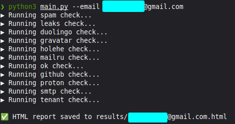
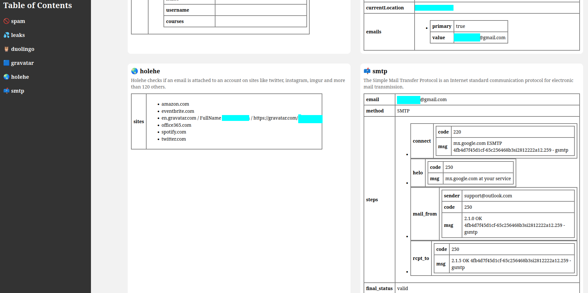

# Solenn Vovo
Solenn Vovo - OSINT program written in Python3 that searches for information about email addresses from various sources

## Features
- You can select a separate module(s) for searching
- Output to HTML file
- No API-keys (maybe later)
- Easy to install and to use

## Installation
```bash
git clone https://github.com/username/solenn_vovo.git
cd solenn_vovo
pip3 install requests holehe PGPy
```
## Usage 
```bash
python3 main.py -h
python3 main.py --email <target>
```


## Output example




