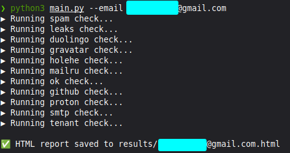
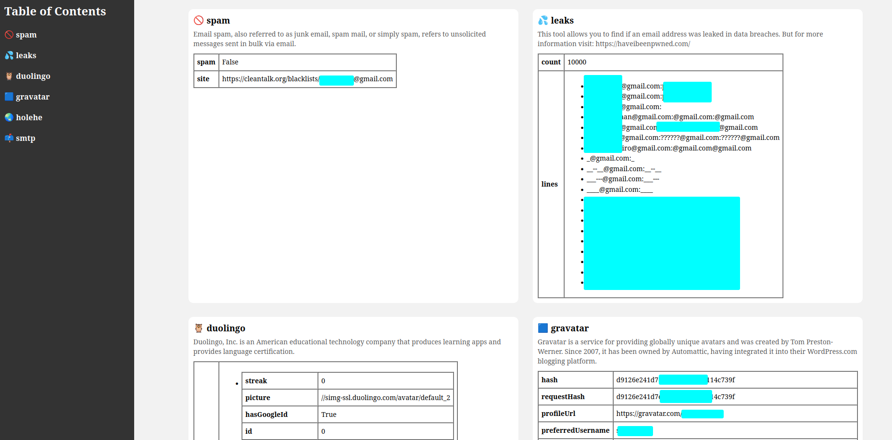
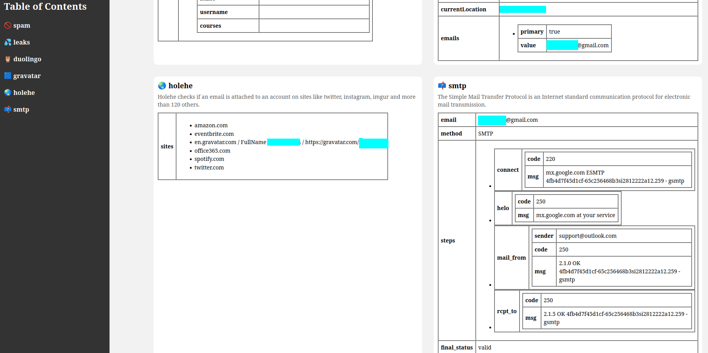
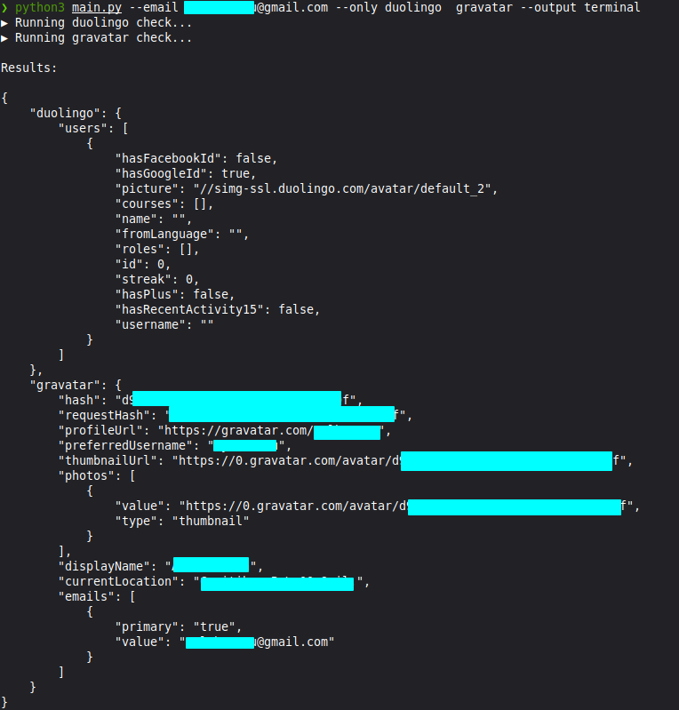

# Solenn Vovo
Solenn Vovo - OSINT program written in Python3 that searches for information about email addresses from different sources

## Requirements
This project requires **Python 3.12.x** to run correctly.

Check your Python version:
```bash
python3 --version
```

## Features
- Select and use separate modules for searching
- Different output formats: JSON, HTML and just an output in terminal
- 14 checkers to find info about an email

## OSINT Modules 

| Name | Account Info | Method |
| :--- | :---: | :---: |
| Spam Check | Spam Reputation | Free API |
| SMTP Validation | Email Status | SMTP | 
| Tenant Lookup | Domain ownership, tenant ID, and organization metadata | Free API |
| Duolingo | Duolingo Profile | Free API |
| Gravatar | Gravatar Profile | Free API |
| Trello | Trello Profile | Session Cookies [Read an instruction to use it](/modules/trello_osint/README.md)|
| GitHub | GitHub Profile | Free API |
| Proton | Account Fingerprint | Auth Detection |
| Flickr | Flickr Profile | Account API Key [Read an instruction to use it](/modules/flickr_osint/README.md)|
| Have I Been Pwned | Breaches | Free API |
| Hudsonrock | Stealers | Free API |
| Holehe | Linked Services | [Many](https://github.com/megadose/holehe) |
| OK | Profile & Masked Phone | Password recovery |
| MailRu | Profile & Masked Phone | Free API (Password recovery) |


## Installation
**1. Clone the repository**
```bash
git clone https://github.com/fenfoe/SolennVovo.git
cd SolennVovo
```
**2. Activate virtual environment**
```bash
python3.12 -m venv venv
source venv/bin/activate
```

**3. Install dependencies**
```bash
pip install -r requirements.txt
```

## Usage 
```bash
#Help message
python3 main.py -h

# To list all available checkers
python3 main.py --list-checkers

# To run all checkers and save a result in a JSON file
python3 main.py --email <target> --output json

# To run only duolingo and gravatar checkers and print result in terminal
python3 main.py --email <target> --only duolingo gravatar --output terminal


```


## Output examples
**HTML output**



**Terminal output**


## Disclaimer
This tool is for educational purposes only. Use of this tool is at your own risk. The author is not responsible for any outcomes resulting from its use.
