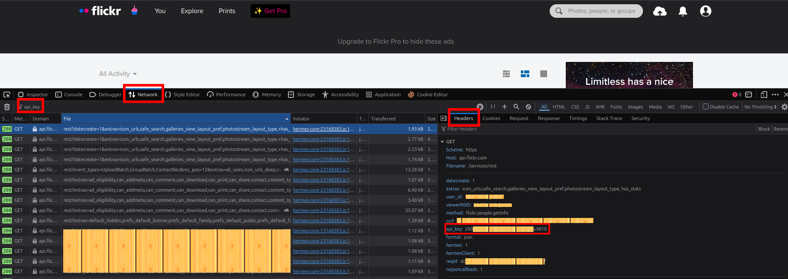

# Flickr Checker
## Usage
To use this checker follow the next steps
1) Create an account on [https://www.flickr.com/](flickr.com)

2) Open DevTools (F12) and go to **Network**

3) Reload the page

4) Type `api_key` in filter bar and click on the first request

5) Now in **Headers** you can find your `api_key`

*Below is an example*

6) Copy this `api_key` and paste it in `flickr.py` (line 6)

## Unfortunately, you should update the `api_key` regularly, so don't forget doing that before using this checker
