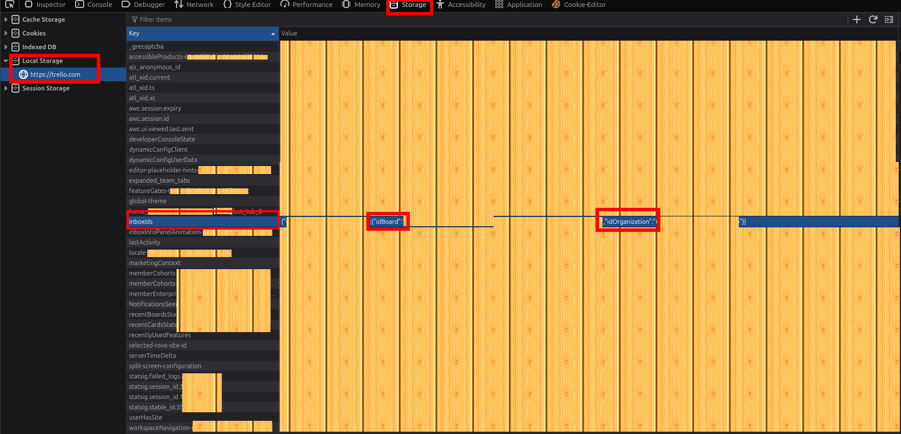

# Trello Checker
## Usage
To use this checker follow the next steps:
1) Create an account on [https://trello.com](Trello.com)

2) Install Cookie-Editor Extension
*   [Chrome Web Store](https://chrome.google.com/webstore/detail/cookie-editor/hlkenndednhfkekhgcdicdfddnkalmdm)
*   [Firefox Add-ons](https://addons.mozilla.org/en-US/firefox/addon/cookie-editor/)

3) Login to Trello

4) Export Cookies:
    *   Click the Cookie-Editor extension icon
    *   Click the **"Export"** button
    *   Select **"JSON"** format

5) Paste cookies in `trello_cookies.json`

6) Go back to your trello account and open DevTools (F12)

7) Find `idBoard` and `idOrganization`
    * Go to **"Strorage"**
    * Click on the **"Local Storage"** on the left
    * Search a "line" which starts with **"inboxIds"** and copy `idBoard` and `idOrganization`
Below is an example

8) Paste `idBoard` and `idOrganization` in `trello.py` (line 10 and 11)
